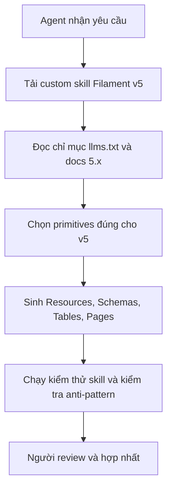
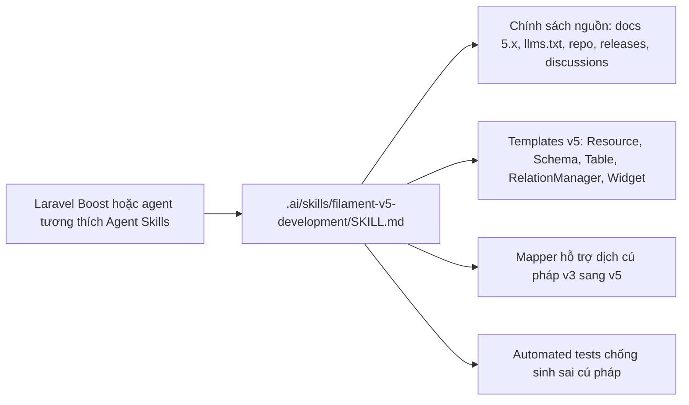

# Nghiên cứu chuyên sâu về skill AI Agent cho FilamentPHP

## Tóm tắt điều hành

Filament hiện đã có nhánh và tài liệu ổn định cho dòng năm, với chính sách hỗ trợ cho biết nhánh này nhận tính năng mới cho tới khi nhánh kế tiếp ổn định được phát hành; trên Packagist, gói `filament/filament` hiện có bản phát hành mới nhất là `v5.6.5` vào ngày 22 tháng 5 năm 2026. Các ràng buộc nâng cấp chính thức cho Filament hiện tại là PHP từ `8.2`, Laravel từ `11.28`, Livewire từ `4.0`, và Tailwind CSS từ `4.0` nếu bạn có custom theme; trong khi đó, gói lõi `filament/support` cho thấy dải hỗ trợ framework thực tế là Laravel `^11.28|^12.0|^13.0` và Livewire `^4.1`.

Kết luận quan trọng nhất cho nhu cầu của bạn là: **nên xây một custom Agent Skill riêng cho Filament v5**, thay vì dựa hoàn toàn vào mặc định của Laravel Boost. Lý do là tài liệu chính thức của Filament v5 đã nói rất rõ rằng Filament hỗ trợ AI agents thông qua Laravel Boost và khuyến khích dùng `llms.txt` để duyệt toàn bộ tài liệu; nhưng tài liệu công khai của Laravel Boost hiện vẫn liệt kê guideline Filament sẵn có ở mức `3.x` và `4.x`, chưa thể hiện rõ coverage `5.x`. Nói cách khác, về mặt AI ergonomics, v5 đã “sống” trong docs của Filament, nhưng lớp guideline/skill mặc định của Boost vẫn có độ trễ; vì vậy một skill v5 tùy biến là cách an toàn nhất để ép agent sinh đúng cú pháp và cấu trúc hiện thời.

Về chiến lược nền tảng, tôi khuyến nghị **Laravel 12 bản vá mới nhất + PHP 8.3 + Livewire 4.3.x + Filament 5.6.x + Tailwind 4.x** như lựa chọn mặc định cho production mới. Đây là điểm cân bằng tốt giữa độ mới, độ ổn định và khả năng tương thích hệ sinh thái. Laravel 13 được Filament hỗ trợ ở mức package constraints, nhưng hiện trạng plugin cộng đồng còn không đồng đều: có package đã hỗ trợ Filament 5, nhưng cũng có package phổ biến vẫn còn ràng buộc Filament 3. Vì ưu tiên của bạn là “work reliably”, Laravel 12 là điểm chốt an toàn hơn cho dự án xanh mới; Laravel 13 chỉ nên chọn khi ma trận plugin của bạn đã xác minh xanh hoàn toàn.

Đối với ứng dụng đang ở Filament 3, đường nâng cấp đáng tin cậy nhất là **đi theo hai chặng**: từ Filament 3 lên Filament 4 bằng script `filament-v4`, rồi từ Filament 4 lên Filament 5 bằng script `filament-v5`. Tài liệu nâng cấp Filament 4 nêu rõ script tự động và thay đổi cấu trúc thư mục resource mặc định; tài liệu nâng cấp Filament 5 tiếp tục yêu cầu script `filament-v5` và nâng Livewire lên v4. Các khác biệt API có tác động cao nhất khi đi từ v3 sang v5 là: chuyển `Form $form` sang `Schema $schema`, chuyển `->schema([...])` sang `->components([...])`, thay đổi cấu trúc file resource mặc định sang thư mục tách `Schemas/` và `Tables/`, và đổi table row actions từ `->actions([...])` sang `->recordActions([...])`.

## Phát hiện chính từ tài liệu chính thức

Filament v5 đã chính thức tổ chức tài liệu theo cách rất thuận lợi cho AI workflows. Trang “AI-assisted development” của Filament nhấn mạnh ba điểm: dùng Laravel Boost để agent viết mã Filament đúng quy ước, dùng `boost:install` để sinh các file cấu hình như `AGENTS.md` hoặc `CLAUDE.md`, và dùng `llms.txt` để agent khám phá chỉ mục tài liệu đầy đủ trước khi phát sinh mã nguồn. Đây là cơ sở tốt nhất để thiết kế một skill chuẩn production: skill không nên cố “nhớ” Filament bằng prompt cứng, mà nên ép agent ưu tiên đúng nguồn chính thức theo thứ tự bạn yêu cầu.

Ngoài ra, Filament v5 đã thay đổi cách mô hình hóa resource theo hướng dễ kiểm soát hơn cho agent. Tài liệu `resources/overview` cho thấy resource mới mặc định gồm `CustomerResource.php`, thư mục `Pages`, thư mục `Schemas` chứa `CustomerForm.php`, và thư mục `Tables` chứa `CustomersTable.php`. Điều này đặc biệt hợp với agent: resource class trở nên mỏng, còn logic form và table được cô lập thành tệp riêng, giảm khả năng agent trộn lẫn responsibilities như thường thấy ở mã sinh tự động theo phong cách cũ.

Một điểm khác rất quan trọng là **version support và patch cadence**. Theo chính sách hỗ trợ của Filament, nhánh 5 nhận tính năng mới cho tới khi nhánh kế tiếp ổn định được phát hành; còn nhánh 3 đã dừng nhận tính năng mới từ năm 2024, chỉ còn bug/security fixes theo thời hạn hỗ trợ. Cộng với việc Packagist cho thấy Filament 5 tiếp tục ra patch đều trong tháng 5 năm 2026, đây là lý do rõ ràng để một AI skill production phải **mặc định target v5 patch mới nhất**, chứ không target “v5 nói chung” theo nghĩa mơ hồ.

Tôi cũng lưu ý một chi tiết thực chiến từ release notes gần đây của repository chính thức: một bản phát hành gần đây đã thay `filter_var()` bằng `Str::sanitizeUrl()` trong `openUrl()` và `newTabUrl()`, đồng thời sửa hành vi không nhất quán của scope khi attach/associate records qua trường chọn. Điều này cho thấy Filament 5 vẫn đang siết chặt các góc cạnh bảo mật và authorization ở level patch; do đó, skill của agent nên khuyến cáo “luôn ở patch mới nhất” và tránh hard-code giả định từ patch cũ.



## Khoảng cách nâng cấp và ánh xạ API

Đối với đội đang đi từ Filament 3 lên Filament 5, cần coi đây là **một hành trình hai chặng**, không phải một cú nhảy thẳng “may rủi”. Tài liệu nâng cấp Filament 4 cung cấp script `vendor/bin/filament-v4`, còn tài liệu nâng cấp Filament 5 cung cấp script `vendor/bin/filament-v5`; đồng thời Filament 5 yêu cầu Livewire 4.0+, nên nếu ứng dụng còn Livewire 3 thì phải xử lý nâng cấp Livewire như một bước riêng. Cách làm đúng là chạy script v4 trước để ổn định cấu trúc resource và config, sau đó mới lên v5.

### Danh sách breaking changes có tải trọng cao

Các thay đổi sau đây là những điểm có khả năng làm agent sinh sai mã hoặc làm code cũ hỏng nặng nhất khi đi từ Filament 3 sang Filament 5:

| Nhóm thay đổi                | Filament cũ                                     | Filament hiện tại                                              | Tác động                                      | Nguồn                                                  |
| ---------------------------- | ----------------------------------------------- | -------------------------------------------------------------- | --------------------------------------------- | ------------------------------------------------------ |
| Nền tảng runtime             | PHP `8.1+`, Laravel `10+`, Livewire `3+`        | PHP `8.2+`, Laravel `11.28+`, Livewire `4.0+`, Tailwind `4.0+` | Bắt buộc nâng runtime và frontend stack       |                         |
| Form signature               | `public static function form(Form $form): Form` | `public static function form(Schema $schema): Schema`          | Sai type-hint sẽ lỗi ngay ở resource          |                         |
| Form builder method          | `->schema([...])`                               | `->components([...])`                                          | Agent rất dễ sinh nhầm cú pháp v3             |                         |
| Cấu trúc resource mặc định   | Mọi thứ dồn trong resource class                | Tách `Schemas/*Form.php` và `Tables/*Table.php` mặc định       | Ảnh hưởng namespace, imports, discoverability |             |
| Table row actions            | `->actions([...])`                              | `->recordActions([...])`                                       | Sai method làm table API lệch version         |                         |
| Resource page references     | `Pages\ListCustomers::route('/')`               | `ListCustomers::route('/')` khi import class theo cấu trúc mới | Ảnh hưởng namespace sau đổi cấu trúc          |                         |
| Cấu hình filesystem mặc định | `FILAMENT_FILESYSTEM_DISK`                      | `FILESYSTEM_DISK` trong v4+ nếu không preserve behavior cũ     | Dễ gây lệch file upload/storage               |                                     |
| Plugin compatibility         | Hệ sinh thái gắn với v3 lâu năm                 | Một số plugin đã lên v5, một số chưa                           | Phải kiểm tra plugin trước khi nâng cấp       | |

### Bảng ánh xạ API và cú pháp cũ sang mới

Bảng dưới đây tập trung vào những ánh xạ có giá trị nhất cho AI agent khi đọc code v3 và sinh code v5.

| Mẫu v3                                                                                 | Mẫu v5 nên sinh                                                                              | Ghi chú                                                                              |
| -------------------------------------------------------------------------------------- | -------------------------------------------------------------------------------------------- | ------------------------------------------------------------------------------------ |
| `use Filament\Forms\Form;`                                                             | `use Filament\Schemas\Schema;`                                                               | Resource form dùng schema layer ở v5.                 |
| `public static function form(Form $form): Form`                                        | `public static function form(Schema $schema): Schema`                                        | Đây là ánh xạ quan trọng nhất cho resource forms.     |
| `return $form->schema([...])`                                                          | `return $schema->components([...])`                                                          | Builder method đổi từ `schema()` sang `components()`. |
| `public static function table(Table $table): Table { return $table->actions([...]); }` | `public static function table(Table $table): Table { return $table->recordActions([...]); }` | Row actions đổi tên rõ ràng hơn.                      |
| Resource class “to” logic form/table                                                   | Resource class gọi `*Form::configure()` và `*Table::configure()`                             | Cấu trúc mặc định mới nên được agent ưu tiên.         |
| `Pages\ListCustomers::route('/')` trong `getPages()`                                   | Import class rồi gọi `ListCustomers::route('/')`                                             | Hệ quả của directory structure mới.                   |
| `FILAMENT_FILESYSTEM_DISK` làm default disk                                            | `FILESYSTEM_DISK` hoặc preserve behavior cũ bằng config                                      | Đây là bẫy config phổ biến khi đi qua v4.                         |

### Quy tắc nâng cấp nên ép vào agent

Nếu agent gặp codebase v3, nó **không nên** tự ý “dịch nhẩm” toàn bộ bằng prompt. Thứ tự an toàn là: nhận diện version hiện có, áp dụng script nâng cấp chính thức phù hợp, sửa những phần còn sót bằng mapping rules có kiểm soát, rồi kiểm thử lại. Filament 5 docs còn nói rõ rằng một số plugin có thể chưa sẵn sàng cho v5 và nên tạm gỡ hoặc thay bằng package tương thích trước khi nâng.

## Môi trường chạy và ma trận phụ thuộc

Vì bạn không khóa Laravel minor version, tôi khuyến nghị mặc định production mới dùng **Laravel 12 patch mới nhất** thay vì Laravel 13. Lập luận ở đây là cân bằng giữa support window và độ chín plugin. Về phía Filament core, package constraints đã hỗ trợ Laravel 12 và 13; về phía Laravel framework, nhánh 12 vẫn còn security fixes tới tháng 2 năm 2027, còn nhánh 13 hỗ trợ lâu hơn nhưng mới hơn và có khả năng gặp độ trễ plugin nhiều hơn. Khi tôi kiểm tra một số package cộng đồng phổ biến, `filament-shield` và `filament-excel` đã hỗ trợ Filament 5, nhưng `awcodes/filament-tiptap-editor` mà tôi kiểm được vẫn đang buộc Filament 3. Điều này nói lên rằng “hỗ trợ core” không đồng nghĩa “hệ sinh thái production đã đồng đều”.

### Ma trận khuyến nghị

| Thành phần   | Mức tối thiểu chính thức                               | Mức khuyến nghị cho production        | Lý do                                                                                                               |
| ------------ | ------------------------------------------------------ | ------------------------------------- | ------------------------------------------------------------------------------------------------------------------- |
| PHP          | `8.2+`                                                 | `8.3`                                 | Vượt mức tối thiểu của Filament 5, và giữ đường lên Laravel 13 nếu cần.              |
| Laravel      | `11.28+`                                               | `12.x` patch mới nhất                 | Cân bằng support window và độ chín plugin.                               |
| Livewire     | `4.0+`                                                 | `^4.1`, tốt nhất là `4.3.x` hiện hành | `filament/support` yêu cầu `^4.1`, trong khi Livewire hiện đã ở `4.3.0`. |
| Filament     | `^5.0`                                                 | `^5.6`                                | Đang có patch mới đều; nên bám patch mới nhất.                                       |
| Tailwind CSS | `4.0+` nếu custom theme                                | `4.x` mới nhất                        | Là yêu cầu nâng cấp chính thức cho custom theme.                                                 |
| Composer     | Không thấy pin minor chính thức trong nguồn đã rà soát | Composer 2 hiện hành                  | Đây là khuyến nghị vận hành, không phải ràng buộc chính thức.                                                       |

### Ma trận package nên có

| Package                        | Đề xuất                         | Ghi chú                                                                                  |
| ------------------------------ | ------------------------------- | ---------------------------------------------------------------------------------------- | -------------------- | --- | ------------------------ |
| `filament/filament`            | `^5.6`                          | Meta package gộp actions, forms, tables, widgets… hiện ở `v5.6.5`.    |
| `livewire/livewire`            | `^4.1`                          | Bám theo `filament/support`.                                          |
| `laravel/boost`                | `--dev`                         | Cần nếu bạn muốn agent skills/MCP/docs search chính thức của Laravel. |
| `filament/upgrade`             | `--dev` khi nâng version        | Chỉ dùng lúc nâng, sau đó remove.                         |
| `bezhansalleh/filament-shield` | Tùy chọn, tốt cho RBAC          | Hỗ trợ Filament `^4                                                                      | ^5`và Laravel`^11.28 | ^12 | ^13`. |
| `pxlrbt/filament-excel`        | Tùy chọn, tốt cho export/import | Nhánh `3.x` hỗ trợ Filament `4.x, 5.x`.                   |

### Ma trận package cần cảnh giác

| Package                          | Trạng thái trong nguồn đã kiểm                                      | Kết luận                                                                                           |
| -------------------------------- | ------------------------------------------------------------------- | -------------------------------------------------------------------------------------------------- |
| `awcodes/filament-tiptap-editor` | Trang Packagist kiểm được vẫn yêu cầu `filament/filament: ^3.2.138` | Không nên giả định tương thích v5; phải kiểm tra kỹ trước khi dùng. |

## Skill AI Agent hoàn chỉnh

Cơ sở cho cách đóng gói dưới đây đến từ Laravel Boost. Tài liệu Boost nói rằng custom skills phải nằm trong `.ai/skills/{skill-name}/SKILL.md`; file `SKILL.md` phải có YAML frontmatter với `name` và `description`, và skill có thể kèm scripts, templates, reference materials. Boost cũng cho phép override skill mặc định hoặc ship skill kèm third-party package ở `resources/boost/skills/{skill-name}/SKILL.md`. Vì vậy, với nhu cầu dùng ngay trong ứng dụng, dạng app-level custom skill là phù hợp nhất.

### Kiến trúc skill được đề xuất



### Cấu trúc thư mục

```text
.ai/
└── skills/
    └── filament-v5-development/
        ├── SKILL.md
        ├── manifest.json
        ├── references/
        │   └── source-priority.md
        ├── templates/
        │   ├── ProductResource.stub.php
        │   ├── ProductForm.stub.php
        │   ├── ProductsTable.stub.php
        │   ├── VariantsRelationManager.stub.php
        │   ├── ProductPolicy.stub.php
        │   ├── ProductsStatsWidget.stub.php
        │   ├── InventoryDashboardPage.stub.php
        │   ├── SeoPreviewField.stub.php
        │   └── seo-preview.blade.php
        ├── tools/
        │   └── FilamentV3ToV5Mapper.php
        └── tests/
            └── FilamentV5SkillTest.php
```

### Manifest phụ trợ

Trong chuẩn Boost, YAML frontmatter trong `SKILL.md` đã là manifest bắt buộc. File `manifest.json` bên dưới là **metadata phụ trợ** tôi đề xuất để đội của bạn version hóa, kiểm thử và audit skill tốt hơn.

```json
{
    "name": "filament-v5-development",
    "version": "1.0.0",
    "type": "agent-skill",
    "summary": "Custom skill for generating, reviewing, migrating, and troubleshooting FilamentPHP v5 code.",
    "runtime": {
        "php": "^8.2",
        "laravel": "^12.0 || ^13.0",
        "filament": "^5.0",
        "livewire": "^4.1"
    },
    "activation": {
        "whenComposerRequiresAny": [
            "filament/filament",
            "filament/forms",
            "filament/tables",
            "filament/support"
        ],
        "whenPathsMatchAny": [
            "app/Providers/Filament/*PanelProvider.php",
            "app/Filament/**"
        ]
    },
    "sourcePriority": [
        "filamentphp.com/docs/5.x",
        "filamentphp.com/docs/llms.txt",
        "github.com/filamentphp/filament",
        "github.com/filamentphp/filament/releases",
        "github.com/filamentphp/filament/discussions"
    ],
    "forbidPatterns": [
        "public static function form(Form $form): Form",
        "->schema([",
        "->actions(["
    ],
    "preferPatterns": [
        "public static function form(Schema $schema): Schema",
        "->components([",
        "->recordActions([",
        "Schemas/*Form.php",
        "Tables/*Table.php"
    ]
}
```

### Nội dung skill chính

```markdown
---
name: filament-v5-development
description: Sinh, review, migrate, và troubleshoot mã FilamentPHP v5 bằng idiom của Filament 5.x; mặc định ưu tiên docs 5.x và tránh sinh cú pháp v3 trừ khi đang làm migration.
---

# Filament v5 Development

## Khi nào dùng skill này

Dùng skill này khi repository có Filament v5 hoặc khi nhiệm vụ liên quan đến:

- Panel providers
- Resources, forms, schemas, tables
- Relation managers
- Widgets, pages, policies
- Custom fields / custom schema components
- Assets / JS / Alpine integration
- Migration mã Filament cũ sang Filament v5

## Thứ tự nguồn bắt buộc

Luôn tra cứu và bám theo thứ tự sau:

1. Tài liệu chính thức Filament 5.x
2. Chỉ mục tài liệu llms.txt của Filament
3. Repository chính filamentphp/filament
4. Releases chính thức
5. Discussions chính thức

Chỉ dùng blog/community package sau khi đã kiểm tra nguồn chính thức.

## Luật cứng cho agent

- Mặc định target Filament 5 patch mới nhất có trong project.
- Với resource forms, dùng:
    - `use Filament\Schemas\Schema;`
    - `public static function form(Schema $schema): Schema`
    - `return $schema->components([...])`
- Với resource tables, ưu tiên tách table ra class riêng:
    - `Tables/*Table.php`
    - `public static function configure(Table $table): Table`
- Với row actions trong table, dùng `recordActions()`, không dùng `actions()` theo kiểu v3.
- Với resource mới, ưu tiên cấu trúc thư mục mới:
    - `Resources/{Plural}/{Resource}.php`
    - `Resources/{Plural}/Schemas/*Form.php`
    - `Resources/{Plural}/Tables/*Table.php`
- Chỉ dùng ví dụ v3 nếu user đang yêu cầu migration.
- Nếu task là migration từ v3:
    - xác định rõ đang ở v3
    - đề xuất đường nâng cấp v3 -> v4 -> v5
    - chạy hoặc mô phỏng mapping cục bộ
    - review namespace, imports, và plugin compatibility
- Nếu có custom JS:
    - đăng ký asset qua Filament asset system
    - lazy load / loadedOnRequest khi có thể
    - nếu gọi server-side từ custom field thì chỉ dùng method có `#[ExposedLivewireMethod]`

## Checklist sinh mã

Mỗi feature Filament v5 phải cố gắng xuất ra đủ:

- migration / model changes nếu có
- Resource
- Schema/Form
- Table
- RelationManager nếu cần
- Policy nếu có authorization
- Widget/Page nếu task yêu cầu
- Tests
- Lưu ý triển khai assets nếu có JS

## Anti-patterns phải từ chối

Không sinh các mẫu sau cho code mới:

- `public static function form(Form $form): Form`
- `return $form->schema([...])`
- nhét toàn bộ form + table vào một resource class rất dài khi không có lý do
- copy code từ docs 3.x cho code mới v5
- giả định plugin cộng đồng đã tương thích v5 nếu chưa kiểm tra

## Mẫu suy luận nhanh

### CRUD resource chuẩn

- Resource mỏng
- Form tách ở `Schemas/*Form.php`
- Table tách ở `Tables/*Table.php`
- List/Create/Edit pages dùng generator mặc định

### Quan hệ

- `BelongsTo`, `MorphTo`, `BelongsToMany`: ưu tiên `Select` / `CheckboxList` khi UX phù hợp
- `HasMany`, `MorphMany`: cân nhắc RelationManager hoặc Repeater
- Nếu cần không gian quản lý riêng, dùng relation page hoặc page tùy chỉnh

### Authorization

- Policy trước
- Sau đó mới resource visibility
- Nếu production cần cứng rắn, khuyến nghị Strict Authorization ở panel

## Thoát hiểm khi tài liệu mâu thuẫn

Nếu repo cài Filament 5 nhưng context agent đang bị kéo về cú pháp cũ:

- bỏ toàn bộ gợi ý v3
- khóa lại theo `Schema`, `components`, `recordActions`
- ghi rõ trong output rằng đã cưỡng bức theo Filament v5 idioms
```

### Tệp tham chiếu ưu tiên nguồn

```markdown
# Source Priority

Luôn ưu tiên:

1. Filament docs 5.x
2. Filament llms index
3. Filament GitHub repo
4. Filament releases
5. Filament discussions

Nguồn bổ sung chỉ dùng sau đó:

- Laravel docs
- Livewire docs
- Packagist
- Community packages đã xác minh version constraints
```

### Template resource

```php
<?php

declare(strict_types=1);

namespace App\Filament\Resources\Products;

use App\Filament\Resources\Products\Pages\CreateProduct;
use App\Filament\Resources\Products\Pages\EditProduct;
use App\Filament\Resources\Products\Pages\ListProducts;
use App\Filament\Resources\Products\RelationManagers\VariantsRelationManager;
use App\Filament\Resources\Products\Schemas\ProductForm;
use App\Filament\Resources\Products\Tables\ProductsTable;
use App\Models\Product;
use Filament\Resources\Resource;
use Filament\Schemas\Schema;
use Filament\Tables\Table;
use Illuminate\Database\Eloquent\Builder;

final class ProductResource extends Resource
{
    protected static ?string $model = Product::class;

    protected static ?string $navigationGroup = 'Catalog';

    protected static ?string $navigationIcon = 'heroicon-o-cube';

    protected static ?int $navigationSort = 10;

    public static function form(Schema $schema): Schema
    {
        return ProductForm::configure($schema);
    }

    public static function table(Table $table): Table
    {
        return ProductsTable::configure($table);
    }

    public static function getRelations(): array
    {
        return [
            'variants' => VariantsRelationManager::class,
        ];
    }

    public static function getPages(): array
    {
        return [
            'index' => ListProducts::route('/'),
            'create' => CreateProduct::route('/create'),
            'edit' => EditProduct::route('/{record}/edit'),
        ];
    }

    public static function getEloquentQuery(): Builder
    {
        return parent::getEloquentQuery()->with(['category']);
    }
}
```

### Template form schema

```php
<?php

declare(strict_types=1);

namespace App\Filament\Resources\Products\Schemas;

use Filament\Forms\Components\FileUpload;
use Filament\Forms\Components\Select;
use Filament\Forms\Components\Textarea;
use Filament\Forms\Components\TextInput;
use Filament\Forms\Components\Toggle;
use Filament\Forms\Set;
use Filament\Schemas\Components\Section;
use Filament\Schemas\Schema;
use Illuminate\Support\Str;

final class ProductForm
{
    public static function configure(Schema $schema): Schema
    {
        return $schema->components([
            Section::make('Content')
                ->schema([
                    TextInput::make('name')
                        ->required()
                        ->maxLength(255)
                        ->live()
                        ->afterStateUpdated(function (Set $set, ?string $state): void {
                            $set('slug', Str::slug((string) $state));
                        }),

                    TextInput::make('slug')
                        ->required()
                        ->maxLength(255)
                        ->unique(ignoreRecord: true),

                    Select::make('category_id')
                        ->relationship('category', 'name')
                        ->searchable()
                        ->preload()
                        ->required(),

                    Textarea::make('excerpt')
                        ->rows(3)
                        ->maxLength(500),

                    Toggle::make('is_active')
                        ->default(true),
                ])
                ->columns(2),

            Section::make('Media')
                ->schema([
                    FileUpload::make('cover_image')
                        ->image()
                        ->directory('products/covers'),

                    FileUpload::make('gallery')
                        ->image()
                        ->multiple()
                        ->directory('products/gallery'),
                ]),
        ]);
    }
}
```

### Template table

```php
<?php

declare(strict_types=1);

namespace App\Filament\Resources\Products\Tables;

use Filament\Actions\BulkActionGroup;
use Filament\Actions\DeleteBulkAction;
use Filament\Actions\EditAction;
use Filament\Tables\Columns\IconColumn;
use Filament\Tables\Columns\ImageColumn;
use Filament\Tables\Columns\TextColumn;
use Filament\Tables\Filters\SelectFilter;
use Filament\Tables\Table;

final class ProductsTable
{
    public static function configure(Table $table): Table
    {
        return $table
            ->columns([
                ImageColumn::make('cover_image')
                    ->label('Image'),

                TextColumn::make('name')
                    ->searchable()
                    ->sortable(),

                TextColumn::make('category.name')
                    ->label('Category')
                    ->sortable(),

                TextColumn::make('price')
                    ->money('USD')
                    ->sortable(),

                IconColumn::make('is_active')
                    ->boolean(),

                TextColumn::make('updated_at')
                    ->dateTime()
                    ->since()
                    ->sortable(),
            ])
            ->filters([
                SelectFilter::make('category')
                    ->relationship('category', 'name'),
            ])
            ->recordActions([
                EditAction::make(),
            ])
            ->toolbarActions([
                BulkActionGroup::make([
                    DeleteBulkAction::make(),
                ]),
            ])
            ->defaultSort('updated_at', 'desc');
    }
}
```

### Template relation manager

```php
<?php

declare(strict_types=1);

namespace App\Filament\Resources\Products\RelationManagers;

use Filament\Actions\CreateAction;
use Filament\Actions\DeleteAction;
use Filament\Actions\DeleteBulkAction;
use Filament\Actions\EditAction;
use Filament\Resources\RelationManagers\RelationManager;
use Filament\Forms\Components\TextInput;
use Filament\Schemas\Schema;
use Filament\Tables\Columns\TextColumn;
use Filament\Tables\Table;

final class VariantsRelationManager extends RelationManager
{
    protected static string $relationship = 'variants';

    protected static ?string $title = 'Variants';

    public function form(Schema $schema): Schema
    {
        return $schema->components([
            TextInput::make('sku')
                ->required()
                ->maxLength(100),

            TextInput::make('name')
                ->required()
                ->maxLength(255),

            TextInput::make('price')
                ->numeric()
                ->required(),
        ]);
    }

    public function table(Table $table): Table
    {
        return $table
            ->columns([
                TextColumn::make('sku')->searchable()->sortable(),
                TextColumn::make('name')->searchable()->sortable(),
                TextColumn::make('price')->money('USD')->sortable(),
            ])
            ->headerActions([
                CreateAction::make(),
            ])
            ->recordActions([
                EditAction::make(),
                DeleteAction::make(),
            ])
            ->toolbarActions([
                DeleteBulkAction::make(),
            ]);
    }
}
```

### Template policy

```php
<?php

declare(strict_types=1);

namespace App\Policies;

use App\Models\Product;
use App\Models\User;

final class ProductPolicy
{
    public function viewAny(User $user): bool
    {
        return $user->can('view_any_product');
    }

    public function view(User $user, Product $product): bool
    {
        return $user->can('view_product');
    }

    public function create(User $user): bool
    {
        return $user->can('create_product');
    }

    public function update(User $user, Product $product): bool
    {
        return $user->can('update_product');
    }

    public function delete(User $user, Product $product): bool
    {
        return $user->can('delete_product');
    }

    public function deleteAny(User $user): bool
    {
        return $user->can('delete_any_product');
    }
}
```

### Template widget

```php
<?php

declare(strict_types=1);

namespace App\Filament\Widgets;

use App\Models\Product;
use Filament\Widgets\StatsOverviewWidget;
use Filament\Widgets\StatsOverviewWidget\Stat;

final class ProductsStatsWidget extends StatsOverviewWidget
{
    protected function getStats(): array
    {
        return [
            Stat::make('Products', (string) Product::query()->count()),
            Stat::make('Active', (string) Product::query()->where('is_active', true)->count()),
            Stat::make('Average Price', '$' . number_format((float) Product::query()->avg('price'), 2)),
        ];
    }
}
```

### Template custom page

```php
<?php

declare(strict_types=1);

namespace App\Filament\Pages;

use Filament\Pages\Page;

final class InventoryDashboardPage extends Page
{
    protected static ?string $navigationIcon = 'heroicon-o-chart-bar';

    protected static ?string $navigationGroup = 'Reports';

    protected static string $view = 'filament.pages.inventory-dashboard';
}
```

```blade
{{-- resources/views/filament/pages/inventory-dashboard.blade.php --}}
<x-filament-panels::page>
    <div class="space-y-4">
        <h2 class="text-xl font-bold">Inventory Dashboard</h2>
        <p class="text-sm text-gray-600">
            Mount widgets, infolists, or custom Livewire components here.
        </p>
    </div>
</x-filament-panels::page>
```

### Template custom field và tích hợp JavaScript

Tài liệu custom fields của Filament 5 cho phép dùng `#[ExposedLivewireMethod]` và gọi từ JavaScript với `$wire.callSchemaComponentMethod()`. Đồng thời, tài liệu assets khuyến nghị lazy load JS và Alpine component bằng asset system khi field dựa nhiều vào thư viện ngoài. Vì vậy, mẫu dưới đây là cách “đúng sách” để agent sinh field tùy biến có JS mà vẫn an toàn.

```php
<?php

declare(strict_types=1);

namespace App\Filament\Forms\Components;

use Filament\Forms\Components\Field;
use Filament\Support\Components\Attributes\ExposedLivewireMethod;
use Illuminate\Support\Str;
use Livewire\Attributes\Renderless;

final class SeoPreviewField extends Field
{
    protected string $view = 'filament.forms.components.seo-preview';

    #[ExposedLivewireMethod]
    #[Renderless]
    public function suggestSlug(string $title): array
    {
        $slug = Str::slug($title);

        return [
            'slug' => $slug,
            'preview' => url('/products/' . $slug),
        ];
    }
}
```

```blade
{{-- resources/views/filament/forms/components/seo-preview.blade.php --}}
@php
    $key = $getKey();
@endphp

<x-dynamic-component
    :component="$getFieldWrapperView()"
    :field="$field"
>
    <div
        x-data="{
            title: '',
            suggestedSlug: '',
            previewUrl: '',
            async generate() {
                const result = await $wire.callSchemaComponentMethod(
                    @js($key),
                    'suggestSlug',
                    { title: this.title },
                )

                this.suggestedSlug = result.slug
                this.previewUrl = result.preview
            }
        }"
        class="space-y-3"
    >
        <input
            type="text"
            x-model="title"
            class="w-full rounded-lg border border-gray-300 px-3 py-2 text-sm"
            placeholder="Enter product title"
        />

        <button
            type="button"
            x-on:click="generate"
            class="rounded-lg border px-3 py-2 text-sm"
        >
            Generate SEO preview
        </button>

        <div x-show="previewUrl" class="rounded-lg border p-3 text-sm">
            <div><strong>Slug:</strong> <span x-text="suggestedSlug"></span></div>
            <div><strong>Preview:</strong> <span x-text="previewUrl"></span></div>
        </div>
    </div>
</x-dynamic-component>
```

### Template đăng ký asset

```php
<?php

declare(strict_types=1);

namespace App\Providers;

use Filament\Support\Assets\Js;
use Filament\Support\Facades\FilamentAsset;
use Illuminate\Support\ServiceProvider;

final class AppServiceProvider extends ServiceProvider
{
    public function boot(): void
    {
        FilamentAsset::register([
            Js::make('filament-slug-helper', resource_path('js/filament/slug-helper.js'))
                ->loadedOnRequest(),
        ]);
    }
}
```

```js
// resources/js/filament/slug-helper.js
window.filamentSlugHelper = function filamentSlugHelper(initialValue = "") {
    return {
        value: initialValue,
        normalize(text) {
            return String(text)
                .toLowerCase()
                .trim()
                .replace(/\s+/g, "-")
                .replace(/[^a-z0-9-]/g, "")
                .replace(/-+/g, "-");
        },
    };
};
```

### Cấu hình tích hợp agent

Filament docs cho biết `boost:install` sẽ sinh `AGENTS.md`, `CLAUDE.md` hoặc file tương tự; Laravel Boost docs cho biết nó cũng có thể sinh `.mcp.json` và `boost.json`. Vì vậy, việc thêm một đoạn activation rule vào `AGENTS.md` là cách đơn giản nhất để buộc agent tải skill của bạn khi gặp Filament 5.

```markdown
## Custom Filament v5 skill activation

If `composer.json` contains `filament/filament` with major version 5, always load the
`filament-v5-development` skill before generating or reviewing code.

Hard rules:

- Prefer Filament docs 5.x and Filament llms index.
- Never generate `public static function form(Form $form): Form` for new code.
- Prefer separated `Schemas/*Form.php` and `Tables/*Table.php`.
- Use `recordActions()` for table row actions.
- If the task is migration from Filament 3, perform a staged migration plan: v3 -> v4 -> v5.
```

### Bộ helper dịch mã cũ sang mã mới

Tài liệu chính thức nhấn mạnh phải review thủ công sau script tự động; vì vậy mapper dưới đây chỉ nên xem là **bộ transform phụ trợ**, không phải compiler hoàn chỉnh. Nó phù hợp cho AI agent khi cần dịch nhanh snippet nhỏ từ v3 sang v5 trước khi người thật review.

```php
<?php

declare(strict_types=1);

namespace App\Ai\Filament;

final class FilamentV3ToV5Mapper
{
    /**
     * Transform hẹp cho resource snippets kiểu v3 sang idiom v5.
     * Không thay thế cho upgrade script chính thức.
     */
    public static function translateResourceSnippet(string $code): string
    {
        $directReplacements = [
            'use Filament\\Forms\\Form;' => 'use Filament\\Schemas\\Schema;',
            'public static function form(Form $form): Form' => 'public static function form(Schema $schema): Schema',
            'return $form' => 'return $schema',
            '->actions([' => '->recordActions([',
        ];

        $code = str_replace(
            array_keys($directReplacements),
            array_values($directReplacements),
            $code
        );

        // Chỉ đổi schema() sang components() bên trong form builder.
        $code = preg_replace(
            '/->schema\(\[/',
            '->components([',
            $code
        ) ?? $code;

        return $code;
    }

    /**
     * Giữ hành vi storage kiểu cũ khi config v4/v5 cần preserve.
     */
    public static function preserveLegacyFilesystemDisk(?string $disk = null): string
    {
        return $disk ?: (string) env('FILAMENT_FILESYSTEM_DISK', 'public');
    }
}
```

## Ví dụ tác vụ Filament theo phong cách hiện tại

Phần này không lặp lại toàn bộ template phía trên, mà minh họa cách dùng chúng để giải các tác vụ phổ biến theo phong cách Filament hiện tại. Cơ sở của các ví dụ là: resource v5 mặc định tách `Schemas` và `Tables`, quan hệ có nhiều cách quản lý khác nhau tùy loại relationship, và panel có thể gắn assets/middleware/render hooks theo từng panel.

### CRUD tài nguyên chuẩn

Filament xác định resource là primitive CRUD cho Eloquent model; generator mặc định sinh List/Create/Edit pages và cho phép thêm View page, soft-deletes hoặc generate tự động. Với v5, agent nên sinh resource mỏng và đẩy phần form/table ra hai lớp riêng.

```bash
php artisan make:filament-resource Product
```

```php
// app/Filament/Resources/Products/Pages/ListProducts.php
<?php

declare(strict_types=1);

namespace App\Filament\Resources\Products\Pages;

use App\Filament\Resources\Products\ProductResource;
use Filament\Actions\CreateAction;
use Filament\Resources\Pages\ListRecords;

final class ListProducts extends ListRecords
{
    protected static string $resource = ProductResource::class;

    protected function getHeaderActions(): array
    {
        return [
            CreateAction::make(),
        ];
    }
}
```

### Forms và tables theo pattern mới

Tín hiệu rõ ràng nhất của v5 là form dùng `Schema` và `components()`, còn table row actions dùng `recordActions()`. Nếu agent tiếp tục sinh `Form $form`, `schema([...])`, hoặc `actions([...])` cho code mới, đó là dấu hiệu chắc chắn của context nhiễu version.

```php
// Trích đoạn đúng phong cách v5
public static function form(Schema $schema): Schema
{
    return $schema->components([
        // fields + layout components
    ]);
}

public static function table(Table $table): Table
{
    return $table
        ->columns([
            // columns
        ])
        ->recordActions([
            EditAction::make(),
        ]);
}
```

### Quan hệ và relation managers

Tài liệu `managing-relationships` của Filament v5 nói rất rõ rằng không có một cách duy nhất để quản lý quan hệ. Với `BelongsTo`, `MorphTo`, `BelongsToMany`, hãy cân nhắc `Select` hoặc `CheckboxList`; với `HasMany` và `MorphMany`, có thể dùng `Repeater` hoặc `RelationManager`. Nếu muốn vùng quản lý riêng biệt, có thể dùng relation page thay vì nhúng hoàn toàn dưới Edit/View page. Đây là logic mà AI agent nên áp dụng trước khi sinh code.

```php
// app/Filament/Resources/Products/RelationManagers/VariantsRelationManager.php
protected static string $relationship = 'variants';
```

```php
// Trong resource
public static function getRelations(): array
{
    return [
        'variants' => VariantsRelationManager::class,
    ];
}
```

### Policies và authorization

Filament v5 cho phép resource không hiện trong nav nếu policy `viewAny()` không pass; panel còn có tùy chọn `strictAuthorization()` để ném exception khi policy hoặc method policy không tồn tại, thay vì ngầm cho qua. Với project production, agent nên mặc định sinh policy trước, rồi mới sinh resource visibility và actions.

```php
// app/Providers/Filament/AdminPanelProvider.php
->strictAuthorization()
```

### Widgets và custom pages

Widgets vẫn là primitive tốt nhất cho dashboard số liệu nhanh, trong khi custom page dùng khi workflow không khớp hẳn resource CRUD. Panel configuration docs cho thấy panel có thể chứa resources, custom pages, và dashboard widgets riêng cho từng nhóm người dùng.

```php
// app/Filament/Widgets/ProductsStatsWidget.php
final class ProductsStatsWidget extends StatsOverviewWidget
{
    protected function getStats(): array
    {
        return [
            Stat::make('Products', '124'),
            Stat::make('Active', '117'),
        ];
    }
}
```

### Custom components, assets, và JS integration

Ở Filament hiện tại, custom field không phải Livewire component; nếu cần gọi server-side từ JavaScript, chỉ những public method được đánh dấu `#[ExposedLivewireMethod]` mới được phép gọi. Với assets, Filament khuyến nghị dùng asset system, có thể `loadedOnRequest()`, có thể lazy load JS/CSS, và với Alpine component bất đồng bộ thì có thể dùng `x-load` cùng asset helpers. Điều này tạo nên một chuỗi chuẩn cho agent: không nhúng JS “bừa” vào Blade nếu có thể đăng ký asset đúng bài bản.

```php
FilamentAsset::register([
    Js::make('custom-script', resource_path('js/custom.js'))->loadedOnRequest(),
]);
```

```blade
<div
    x-data="{}"
    x-load-js="[@js(\Filament\Support\Facades\FilamentAsset::getScriptSrc('custom-script'))]"
>
    <!-- custom UI -->
</div>
```

## Kiểm thử, vận hành và xử lý sự cố

Tài liệu testing của Filament v5 cho thấy hướng chuẩn là test resources dưới dạng Livewire components, dùng các helper như `assertCanSeeTableRecords()`, `searchTable()`, `sortTable()`, `filterTable()` và cả testing actions riêng. Vì vậy, một skill production không nên dừng ở “generate code”, mà phải tự kiểm tra các anti-pattern của chính nó và gợi ý bộ test ứng dụng đúng nhịp của Filament.

### Automated tests cho skill

```php
<?php

declare(strict_types=1);

namespace Tests\Unit;

use PHPUnit\Framework\TestCase;

final class FilamentV5SkillTest extends TestCase
{
    private string $root;

    protected function setUp(): void
    {
        parent::setUp();

        $this->root = base_path('.ai/skills/filament-v5-development');
    }

    public function testSkillFileHasRequiredFrontmatter(): void
    {
        $skill = file_get_contents($this->root . '/SKILL.md');

        $this->assertIsString($skill);
        $this->assertMatchesRegularExpression('/^---\s*[\s\S]*name:\s*filament-v5-development[\s\S]*description:/', $skill);
    }

    public function testSkillForbidsLegacyV3ResourceFormSignature(): void
    {
        $skill = file_get_contents($this->root . '/SKILL.md');

        $this->assertIsString($skill);
        $this->assertStringContainsString('public static function form(Schema $schema): Schema', $skill);
        $this->assertStringContainsString('public static function form(Form $form): Form', $skill);
        $this->assertStringContainsString('Anti-patterns', $skill);
    }

    public function testResourceTemplateUsesSchemaLayer(): void
    {
        $template = file_get_contents($this->root . '/templates/ProductResource.stub.php');

        $this->assertIsString($template);
        $this->assertStringContainsString('use Filament\\Schemas\\Schema;', $template);
        $this->assertStringContainsString('public static function form(Schema $schema): Schema', $template);
        $this->assertStringNotContainsString('use Filament\\Forms\\Form;', $template);
    }

    public function testFormTemplateUsesComponentsInsteadOfLegacySchemaBuilder(): void
    {
        $template = file_get_contents($this->root . '/templates/ProductForm.stub.php');

        $this->assertIsString($template);
        $this->assertStringContainsString('->components([', $template);
    }

    public function testTableTemplateUsesRecordActions(): void
    {
        $template = file_get_contents($this->root . '/templates/ProductsTable.stub.php');

        $this->assertIsString($template);
        $this->assertStringContainsString('->recordActions([', $template);
        $this->assertStringNotContainsString('->actions([', $template);
    }

    public function testRequiredFilesExist(): void
    {
        $required = [
            '/SKILL.md',
            '/manifest.json',
            '/templates/ProductResource.stub.php',
            '/templates/ProductForm.stub.php',
            '/templates/ProductsTable.stub.php',
            '/templates/VariantsRelationManager.stub.php',
            '/tools/FilamentV3ToV5Mapper.php',
        ];

        foreach ($required as $path) {
            $this->assertFileExists($this->root . $path, "Missing file: {$path}");
        }
    }
}
```

### Manual test matrix

| Tình huống      | Prompt thủ công                                  | Tiêu chí đạt                                                                               |
| --------------- | ------------------------------------------------ | ------------------------------------------------------------------------------------------ |
| Sinh CRUD mới   | “Tạo Product resource cho Filament v5”           | Agent sinh `Schema $schema`, tách `Schemas/` và `Tables/`, không sinh `Form $form`         |
| Dịch code cũ    | “Chuyển snippet resource Filament 3 này sang v5” | Agent mô tả đường nâng cấp theo hai chặng và dùng mapper/official scripts                  |
| Quan hệ         | “Thêm relation manager cho variants”             | Agent sinh `RelationManager` đúng namespace, `form(Schema $schema)`, `table(Table $table)` |
| JS integration  | “Thêm custom SEO preview field có JS”            | Agent dùng `ExposedLivewireMethod`, không gọi method Livewire tùy tiện                     |
| Authorization   | “Khóa delete chỉ cho admin”                      | Agent sinh Policy và/hoặc gợi ý `strictAuthorization()` nếu phù hợp                        |
| Troubleshooting | “Vì sao resource không hiện nav?”                | Agent kiểm chính sách `viewAny()` và panel registration                                    |

### Troubleshooting guide

| Triệu chứng                                    | Nguyên nhân có khả năng cao                                               | Cách xử lý                                                                                                                                           |
| ---------------------------------------------- | ------------------------------------------------------------------------- | ---------------------------------------------------------------------------------------------------------------------------------------------------- |
| Agent sinh `Form $form` và `->schema([...])`   | Context bị kéo về Filament cũ hoặc docs sai version                       | Ép load custom skill này; khóa nguồn ở docs 5.x và `llms.txt`; scan output để chặn mẫu v3.                            |
| Resource không hiện trên navigation            | Model policy có `viewAny()` trả về `false` hoặc không đúng như kỳ vọng    | Kiểm tra policy trước, đặc biệt `viewAny()`.                                                                                      |
| Panel mới tạo không vào được                   | Service provider của panel chưa được register hoặc path bị xung đột route | Kiểm tra `bootstrap/providers.php`, `make:filament-panel`, và nếu dùng `path('')` thì xem lại route root.             |
| Asset JS/CSS không hoạt động                   | Chưa đăng ký asset đúng cách hoặc chưa chạy publish assets                | Dùng `FilamentAsset::register()`, `loadedOnRequest()` khi cần, rồi chạy `php artisan filament:assets`.    |
| Upgrade lên v5 làm plugin vỡ                   | Một số plugin chưa tương thích v5                                         | Tạm gỡ, thay thế, hoặc hoãn nâng cho tới khi plugin sẵn sàng; kiểm tra Packagist constraints. |
| Attach/associate cho record lạ hoặc vượt scope | Đang ở patch cũ của Filament 5                                            | Nâng ít nhất lên patch đã chứa fix scope enforcement; tốt nhất dùng bản mới nhất hiện có.                              |

### Khuyến nghị bảo mật và hiệu năng

Ở lớp bảo mật, ba điểm nên được “hard-code” vào tư duy của agent. Thứ nhất, dùng policies và cân nhắc `strictAuthorization()` cho panel production để tránh vô tình cho qua resource chưa có policy đầy đủ. Thứ hai, với custom field có JavaScript, chỉ public method được gắn `#[ExposedLivewireMethod]` mới nên cho gọi từ frontend; Filament docs mô tả đây là biện pháp bảo mật để ngăn thực thi method tùy ý. Thứ ba, nên giữ Filament ở patch mới nhất vì các bản vá gần đây đã chạm trực tiếp vào URL sanitization và scope enforcement.

Ở lớp hiệu năng, docs gợi ý several wins khá rõ. Hãy giữ assets theo panel và lazy load JS/CSS khi có thể; với custom Alpine components hoặc field phụ thuộc thư viện ngoài, dùng asynchronous loading và `loadedOnRequest()` để không kéo nặng toàn panel. Ngoài ra, Filament cảnh báo rằng SPA prefetching có thể làm tăng băng thông và tải server trên các trang nặng; chỉ bật khi bạn hiểu trade-off. Relation managers mặc định còn được lazy load, nên đừng tắt tùy tiện nếu không có lý do.

## Changelog của skill

### Changelog ngắn

| Phiên bản | Nội dung                                                                                                                                                                                                                                                                                                  |
| --------- | --------------------------------------------------------------------------------------------------------------------------------------------------------------------------------------------------------------------------------------------------------------------------------------------------------- |
| `1.0.0`   | Bản đầu tiên của skill chuyên cho Filament v5; thêm source priority theo yêu cầu của bạn; thêm templates v5-first cho Resource, Schema, Table, RelationManager, Widget, Page; thêm custom field + JS integration; thêm mapper hỗ trợ dịch snippet v3 sang v5; thêm automated tests chống sinh cú pháp cũ. |

### Kết luận cuối cùng

Từ các nguồn chính thức đã rà soát, cách triển khai chắc tay nhất cho nhu cầu của bạn là: **Laravel Boost + custom app-level skill `filament-v5-development` + quy tắc nguồn cứng theo docs 5.x/llms.txt + test tự động chống sinh cú pháp v3**. Đây là giải pháp phù hợp vì Filament v5 đã có tài liệu AI tốt và structure mặc định rất hợp với agent, nhưng lớp skill/guideline mặc định của Boost hiện chưa thể hiện coverage Filament 5 rõ ràng như bạn cần.

### Giới hạn và câu hỏi còn mở

Có hai giới hạn cần nói thẳng. Một là tôi không giải ngược toàn bộ quy tắc nội bộ của gói `filament/upgrade`; vì vậy mapper trong báo cáo này cố ý chỉ là transformer hẹp, an toàn, dùng để hỗ trợ review chứ không thay thế script nâng cấp chính thức. Hai là tình trạng plugin cộng đồng biến động rất nhanh; những ví dụ tôi kiểm đã đủ để chứng minh rằng hệ sinh thái không đồng đều, nhưng trước khi production rollout bạn vẫn nên xác minh lại đúng package mà dự án thực sự dùng.
