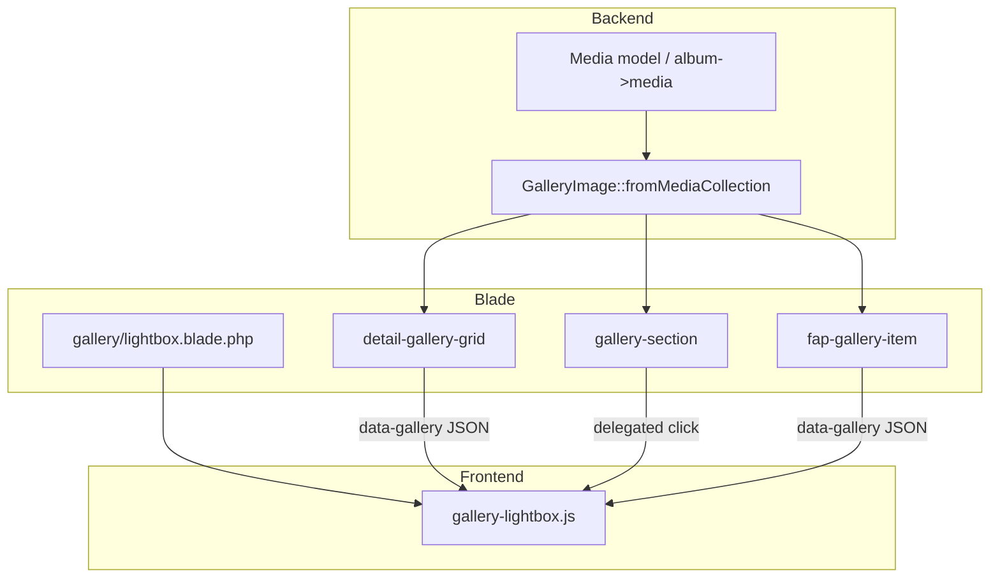

# Professional Grid Gallery Lightbox

## Overview

Thêm trải nghiệm xem ảnh chuyên nghiệp cho **tất cả grid gallery** trên client site: click ảnh → phóng to fullscreen, có thumbnail strip phía dưới để chuyển ảnh, hỗ trợ keyboard và mobile.

Hiện tại các grid chỉ có hover scale (`group-hover:scale-105`) và `cursor-pointer` nhưng **không có lightbox**. Swiper đã dùng cho hero slider (photojournalism/videography detail) — **ngoài scope** vì đó là carousel, không phải grid.

## Problem Statement

| Vấn đề | Chi tiết |
|--------|----------|
| Không có viewer | Click ảnh không làm gì (hoặc chỉ decorative) |
| Logic rời rạc | 4+ blade partials lặp markup grid + hover |
| Giới hạn ảnh | `detail-gallery-grid` pad/cắt còn **8 ảnh** dù album có nhiều hơn |
| JS động | `gallery-section` render HTML bằng `innerHTML` — lightbox phải dùng event delegation |
| Stack hiện tại | Tailwind CDN + vanilla JS inline, **không có Vite/npm** frontend bundle |

## Solution Summary

1. **Backend helper** `App\Support\GalleryImage` — chuẩn hóa collection media → `{ src, thumb, alt, width?, height? }[]`
2. **Singleton lightbox** — 1 modal Blade component + 1 file JS (`gallery-lightbox.js`) load global
3. **Data-attribute contract** — mỗi gallery group: `data-gallery-id`, mỗi item: `data-gallery-item` + JSON hoặc index
4. **Thumbnail strip** — horizontal scroll, active thumb highlighted, click để jump
5. **Tích hợp lần lượt** 4 surface grid chính + home F&P section (optional P2)

## Architecture Diagram



## In-Scope Gallery Surfaces

| # | Page | File | Priority |
|---|------|------|----------|
| 1 | Event Photos detail | `detail-gallery-grid.blade.php` | P1 |
| 2 | Faces & Places detail | `detail-gallery-grid.blade.php` (shared) | P1 |
| 3 | Event Photos index | `gallery-section.blade.php` | P1 |
| 4 | Faces & Places index | `fap-gallery-item.blade.php` | P1 |
| 5 | Home — Faces & Places | `faces-and-places-section.blade.php` | P2 |

## Out of Scope

- Photojournalism / Videography **hero swiper** (đã có Swiper carousel)
- Home photojournalism / event photography **link cards** (navigate, không phải grid viewer)
- Admin Filament media upload UI
- Video playback trong lightbox

## Phases

| Phase | Name | Effort | Status |
|-------|------|--------|--------|
| 1 | [Research & Architecture](./phase-01-research-architecture.md) | 2h | Pending |
| 2 | [Core Lightbox Component](./phase-02-core-lightbox-component.md) | 6h | Pending |
| 3 | [Gallery Integration](./phase-03-gallery-integration.md) | 5h | Pending |
| 4 | [Backend Data & Tests](./phase-04-backend-data-tests.md) | 3h | Pending |

**Total estimate:** ~16h (2 ngày dev)

## Key Technical Decisions

### Lightbox: PhotoSwipe v5 CDN (validated)

| Option | Pros | Cons | Verdict |
|--------|------|------|---------|
| **PhotoSwipe v5 CDN** | Zoom-ready core, battle-tested, keyboard/touch | Thumb strip cần custom UI layer bên dưới | **Chọn (validated)** |
| Custom `gallery-lightbox.js` | Khớp design 100% | Nhiều công maintain | Loại |

PhotoSwipe integration:
- Load `photoswipe@5` + CSS từ CDN (tương tự Swiper đang dùng)
- Custom **thumbnail strip** bên dưới viewport (PhotoSwipe không có sẵn — build bằng Tailwind + vanilla JS hook vào `change` event)
- v1: `object-fit` fit viewport, **không** pinch-zoom gesture
- Body scroll lock qua PhotoSwipe API

### Grid images: hiển thị tất cả (validated)

- **Bỏ** `pad(8)->take(8)` trong `detail-gallery-grid`
- Grid masonry hiển thị toàn bộ media album; lightbox dùng cùng dataset

### Scope v1 (validated)

- **In v1:** Event Photos detail/index, F&P detail/index
- **Defer P2:** Home `faces-and-places-section.blade.php`

### Data contract

```html
<div data-gallery="event-album-slug"
     data-gallery-images='[{"src":"...","thumb":"...","alt":"..."}]'>
  <button type="button" data-gallery-index="0" class="gallery-trigger">...</button>
</div>
```

- `data-gallery-images` chứa **toàn bộ** ảnh album (không cắt 8)
- Grid vẫn có thể hiển thị subset; lightbox dùng full list
- `gallery-trigger` là `<button>` bọc ảnh (a11y), không dùng `<a href="#">`

## Dependencies

- Không block bởi plan khác (chưa có plan unfinished trong `./plans/`)
- Không cần migration DB — dùng `Media` hiện có (`file_url`, `width`, `height`, `priority`)

## Risks

| Risk | Mitigation |
|------|------------|
| Ảnh lớn load chậm | `thumb` dùng cùng URL (lazy), phase 2 có thể thêm resize sau |
| `innerHTML` re-render mất listener | Event delegation trên `#gallery-container` |
| Duplicate lightbox instances | Singleton trong `main-client` layout |
| iOS Safari scroll lock | `document.body.style.overflow = 'hidden'` + `position: fixed` fallback |

## Success Criteria (Global)

- [ ] Click bất kỳ ảnh grid nào trong 4 surface P1 → mở lightbox đúng ảnh
- [ ] Thumbnail strip hiển thị tất cả ảnh album, click thumb chuyển ảnh
- [ ] Keyboard + mobile swipe hoạt động
- [ ] Album detail hiển thị **tất cả** media trong lightbox (không giới hạn 8)
- [ ] Pest feature tests pass
- [ ] Không regression layout grid hiện tại

## Next Steps After Plan

Validated 2026-06-17. Ready for implementation.

Implement: `/ck:cook c:\Users\minhlong\Desktop\projects\la-hieu-fullstack\plans\260617-grid-gallery-lightbox\plan.md`

## Validation Log

### Verification Results (Standard tier)
- Claims checked: 12
- Verified: 10 | Failed: 2 | Unverified: 0
- Tier: Standard
- Failures:
  - Plan ghi `EventPhotosController` / `FacesPlacesController` — thực tế là `EventPhotoController` / `FacesAndPlacesController`
  - Phase 4 đề xuất thêm `orderBy('priority')` — **đã có sẵn** trong cả 2 controllers

### Validation Session 1 (2026-06-17)

| Question | Decision |
|----------|----------|
| Grid image limit | Hiển thị **tất cả** ảnh trong grid + lightbox; bỏ cap 8 |
| Home F&P section | **Defer P2** — v1 chỉ 4 trang album chính |
| Lightbox library | **PhotoSwipe v5 CDN** + custom thumb strip |
| Zoom gesture | **Fit viewport only** v1 (object-contain) |

### Whole-Plan Consistency Sweep
- [x] Phase 2 updated: PhotoSwipe thay custom JS
- [x] Phase 3 updated: bỏ 8-image cap, defer home section
- [x] Phase 4 updated: controller names corrected, bỏ redundant orderBy task
- [x] No unresolved contradictions
