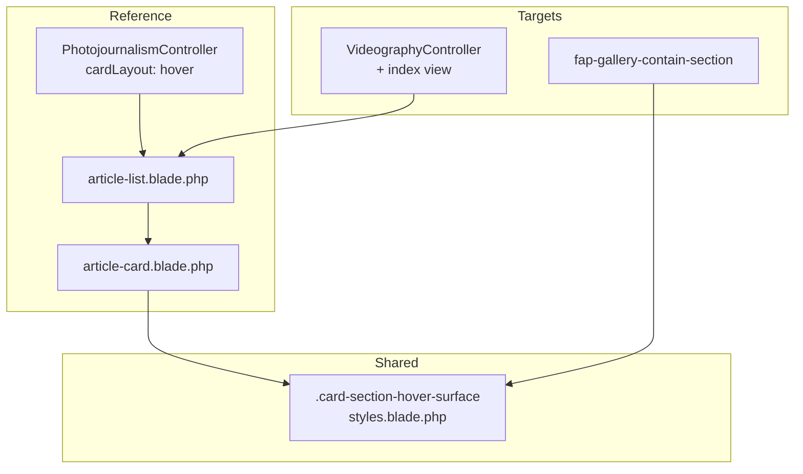

# Card Section Hover Background

## Overview

User muốn khi hover vào **một section/card** trên các trang **Videography** và **Faces & Places** thì background chuyển sang màu xám nhạt `#FAFAFA` — giống hành vi hiện có trên trang **Photojournalism**.

> **Validated 2026-06-18:** Event Photos **ngoài scope** — layout sidebar + masonry không có card section tương đương; user xác nhận bỏ qua.

Photojournalism đã implement pattern này qua `cardLayout => 'hover'` → `article-card` variant `hover` dùng pseudo-element `::before` full-bleed với transition opacity 500ms. Plan này mở rộng pattern đó sang 3 trang còn lại, đồng thời **DRY** class Tailwind lặp lại thành utility dùng chung.

## Problem Statement

| Trang | Hiện trạng | Gap |
|-------|-----------|-----|
| Photojournalism | `cardLayout: hover` → full-width gray band on hover | ✅ Reference |
| Videography | Dùng chung `article-list` nhưng **không** truyền `cardLayout` → fallback `zigzag` (không hover) | Thiếu 1 dòng config |
| Faces & Places | Mỗi album là block dọc trong `fap-gallery-contain-section`; padding `px-[30px]` ở section cha → hover không thể tràn full viewport | Cần restructure wrapper |
| Event Photos | Layout sidebar + masonry | **Out of scope** (user validated) |

## Reference Implementation (Photojournalism)

```php
// PhotojournalismController.php
'cardLayout' => 'hover',
```

```blade
{{-- article-list.blade.php --}}
<a href="..." class="block {{ $isHoverLayout ? 'group' : '' }}">
    <x-clients.shared.article-card :variant="$cardLayout" ... />
</a>
```

```blade
{{-- article-card.blade.php (variant hover) --}}
$hoverSurfaceClass = 'relative isolate before:... before:bg-[#FAFAFA] ... group-hover:before:opacity-100 ...';
```

**Mechanism:** Parent có `group`, surface có `before:absolute before:inset-0` → band xám phủ full chiều ngang của surface (viewport-width khi surface là `w-full`).

## Solution Summary

1. **Extract** hover surface class → CSS utility `.card-section-hover-surface` trong `styles.blade.php` (tránh duplicate chuỗi Tailwind dài)
2. **Refactor** `article-card` dùng utility mới (không đổi behavior Photojournalism)
3. **Videography:** truyền `cardLayout => 'hover'` từ controller + view
4. **Faces & Places:** bọc mỗi album bằng full-width hover wrapper; chuyển padding vào inner
5. **Tests:** assert class/utility có mặt trên Videography + Faces & Places index

## Architecture



## In Scope

| # | Surface | File chính | Effort |
|---|---------|-----------|--------|
| 1 | Shared CSS utility | `styles.blade.php`, `article-card.blade.php` | 30m |
| 2 | Videography index | `VideographyController.php`, `videography/index.blade.php` | 15m |
| 3 | Faces & Places index | `fap-gallery-contain-section.blade.php` | 45m |
| 4 | Pest feature assertions | `ClientPageDataBindingTest.php` | 20m |

**Total estimate:** ~2h

## Out of Scope

- Photojournalism (đã có — chỉ refactor dùng shared utility)
- Detail pages (event-photos/show, faces-and-places/show, videography/show)
- Home page sections (event-photography-section, faces-and-places-section)
- **Event Photos index** — user validated out of scope
- Detail pages, home sections

## Phases

| Phase | Name | Effort | Status |
|-------|------|--------|--------|
| 1 | [Research & Audit](./phase-01-research-audit.md) | 30m | Pending |
| 2 | [Shared Hover Utility](./phase-02-shared-hover-utility.md) | 30m | Pending |
| 3 | [Videography Integration](./phase-03-videography-integration.md) | 15m | Pending |
| 4 | [Faces and Places Integration](./phase-04-faces-and-places-integration.md) | 45m | Pending |
| 5 | [Event Photos Integration](./phase-05-event-photos-integration.md) | — | **Cancelled** |
| 6 | [Tests & QA](./phase-06-tests-qa.md) | 20m | Pending |

## Key Technical Decisions

### CSS utility vs Tailwind inline

| Option | Pros | Cons | Verdict |
|--------|------|------|---------|
| **CSS class trong `styles.blade.php`** | DRY, dễ grep, không phụ thuộc Tailwind arbitrary variant | Thêm 1 pattern ngoài Tailwind | **Chọn** |
| Giữ inline Tailwind duplicate | Khớp code hiện tại | 3+ chỗ copy chuỗi dài | Loại |

### Videography: controller vs view-only

Truyền `cardLayout` từ **controller** (mirror `PhotojournalismController`) — single source of truth, testable.

### F&P: padding relocation

Section cha bỏ `px-[30px] md:px-4`; mỗi album wrapper `w-full` + hover surface; inner content giữ padding cũ.

## Dependencies

- Không block bởi plan khác (`260617-grid-gallery-lightbox` đã completed)
- Không migration DB
- Tailwind CDN (đã có) + custom CSS trong `styles.blade.php`

## Risks

| Risk | Mitigation |
|------|------------|
| F&P hover không full viewport do `max-w` con | Wrapper hover ở ngoài cùng `w-full`; chỉ content bên trong có `max-w` |
| Regression Photojournalism sau refactor utility | Giữ nguyên DOM structure; chỉ đổi class string → CSS class |
| `group` nested (F&P image slots cũng dùng `group`) | Hover surface `group` ở wrapper album; image `group` nested không ảnh hưởng `group-hover` của parent |

## Success Criteria (Global)

- [ ] Hover Videography article card → band `#FAFAFA` full-width, transition 500ms
- [ ] Hover F&P album block → band `#FAFAFA` full viewport width
- [ ] Photojournalism behavior không đổi sau refactor shared utility
- [ ] `php artisan test --filter=ClientPageDataBinding` pass

## Validation Log

### Verification Results (Standard tier)
- Claims checked: 14
- Verified: 14 | Failed: 0 | Unverified: 0
- Tier: Standard
- Key files confirmed: `PhotojournalismController`, `VideographyController`, `article-card`, `fap-gallery-contain-section`, `gallery-section`

### Session 1 — 2026-06-18
**Trigger:** `/ck:plan validate`
**Questions asked:** 3

#### Questions & Answers

1. **[Scope] Event Photos index — áp dụng hover xám ở đâu?**
   - Options: Sidebar nav hover | Restructure album cards | Image overlay
   - **Answer:** Không làm hiệu ứng này cho Event Photos
   - **Rationale:** Layout sidebar + masonry không có card section; user chọn bỏ khỏi scope

2. **[Architecture] Cách triển khai hover surface dùng chung?**
   - Options: CSS utility `.card-section-hover-surface` | Tailwind inline duplicate
   - **Answer:** CSS utility trong `styles.blade.php`

3. **[Scope] Event Photos mobile**
   - Options: Skip mobile v1 | Hover title mobile
   - **Answer:** Skip mobile (moot — Event Photos out of scope)

#### Confirmed Decisions
- Event Photos: **out of scope** — Phase 5 cancelled
- Shared utility: **CSS class** `.card-section-hover-surface`
- In-scope pages: **Videography + Faces & Places** (+ Photojournalism refactor only)

#### Impact on Phases
- Phase 5: **Cancelled**
- Phase 6: Remove Event Photos test assertions

### Whole-Plan Consistency Sweep
- [x] plan.md overview, phases table, success criteria updated
- [x] Phase 5 marked cancelled
- [x] Phase 6 tests scoped to 2 pages
- [x] No unresolved contradictions

## Next Steps

Implement: `/ck:cook c:\Users\minhlong\Desktop\projects\la-hieu-fullstack\plans\260618-card-hover-background\plan.md`
