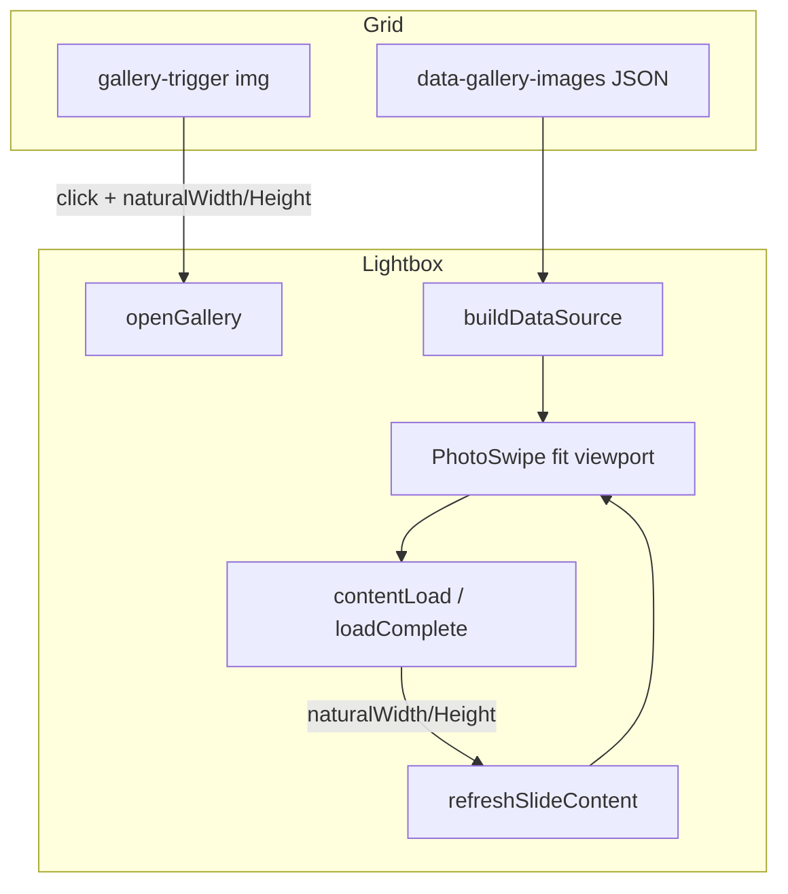

# Fix Lightbox Image Aspect Ratio

## Overview

Trên các trang gallery (Event Photos, Faces & Places), click ảnh đã mở lightbox PhotoSwipe fullscreen. **Bug hiện tại:** ảnh preview bị **kéo méo** (stretch) để lấp đầy khung vì PhotoSwipe nhận **sai tỷ lệ width/height**. User muốn ảnh vẫn **phóng to tối đa trong viewport** (hình chữ nhật như hiện tại) nhưng **giữ đúng tỷ lệ gốc** — tương đương `object-contain`, không `object-fill`.

Plan này là **bugfix** cho feature đã ship trong [`260617-grid-gallery-lightbox`](../260617-grid-gallery-lightbox/plan.md) (status: completed).

## Problem Statement

| Triệu chứng | Nguyên nhân gốc |
|-------------|-----------------|
| Ảnh portrait bị kéo ngang | Fallback cứng `1920×1280` (3:2 landscape) khi DB thiếu dimensions |
| Ảnh square / 16:9 bị méo | `GalleryImage::fromPaths()` luôn gán `1920×1280` bất kể ảnh thật |
| Media có `width`/`height` null | `MediaProcessor` chỉ đọc `getimagesize` trên disk local — S3/remote → null → fallback sai |
| PhotoSwipe stretch | PhotoSwipe dùng `width`/`height` từ dataSource để tính slide container **trước khi** ảnh load; container sai tỷ lệ → `` bị stretch |

### Code hiện tại (điểm lỗi)

```15:21:public/client/assets/js/gallery-lightbox.js
function buildDataSource(images) {
    return images.map((image) => ({
        src: image.src,
        width: Number(image.width) || 1920,
        height: Number(image.height) || 1280,
        alt: image.alt || '',
    }));
}
```

```59:65:app/Support/GalleryImage.php
            $images[] = [
                'src' => $src,
                'thumb' => $src,
                'alt' => "{$altPrefix} ".($index + 1),
                'width' => self::DEFAULT_WIDTH,
                'height' => self::DEFAULT_HEIGHT,
            ];
```

PhotoSwipe đã cấu hình `initialZoomLevel: 'fit'` — **đúng về mặt ý định**, nhưng `fit` chỉ hoạt động chính xác khi slide dimensions khớp ảnh thật.

## Solution Summary

**Chiến lược 2 lớp** (JS là fix chính, backend là cải thiện dữ liệu):

1. **JS — đọc kích thước thật sau load** (`naturalWidth`/`naturalHeight`) → cập nhật slide → `refreshSlideContent`. Đảm bảo không méo dù backend truyền sai.
2. **JS — ưu tiên dimensions từ thumbnail đã render** khi mở lightbox (ảnh grid đã load → `naturalWidth/Height` có sẵn cho slide đầu).
3. **Backend — cải thiện fallback** trong `GalleryImage`: không gán 1920×1280 giả khi không biết; để JS probe. Tùy chọn backfill dimensions cho media thiếu (P2, nếu audit phát hiện nhiều record null).

## Architecture



## In-Scope Surfaces

Tất cả surface dùng `gallery-lightbox.js` + `data-gallery-images`:

| # | Page | File |
|---|------|------|
| 1 | Event Photos detail | `detail-gallery-grid.blade.php` |
| 2 | Faces & Places detail | `detail-gallery-grid.blade.php` |
| 3 | Event Photos index | `gallery-section.blade.php` |
| 4 | Faces & Places index | `fap-gallery-item.blade.php` |

**Out of scope:** Swiper hero sliders (photojournalism/videography detail), admin upload UI.

## Phases

| Phase | Name | Effort | Status |
|-------|------|--------|--------|
| 1 | [Research & Audit](./phase-01-research-audit.md) | 1h | Pending |
| 2 | [Fix Lightbox Fit](./phase-02-fix-lightbox-fit.md) | 3h | Pending |
| 3 | [Tests & QA](./phase-03-tests-qa.md) | 1.5h | Pending |

**Total estimate:** ~5.5h

## Key Technical Decisions

| Decision | Rationale |
|----------|-----------|
| Fix chính ở JS (`contentLoad`) | Hoạt động với mọi nguồn ảnh, không phụ thuộc DB đầy đủ |
| Giữ `initialZoomLevel: 'fit'` | Đúng yêu cầu: phóng to max trong viewport, không crop |
| Không thêm pinch-zoom | Ngoài scope bugfix; giữ config hiện tại `zoom: false` |
| Không dùng Vite/npm | Tuân pattern CDN hiện có |
| Backend fallback = omit hoặc 0 | PhotoSwipe + JS probe xử lý; tránh hardcode 3:2 sai |

## Dependencies

- **Related:** `260617-grid-gallery-lightbox` (completed) — plan này sửa regression UX
- **No block** từ `260618-card-hover-background` (hover CSS, không đụng lightbox)

## Risks

| Risk | Mitigation |
|------|------------|
| Layout jump khi dimensions cập nhật sau load | Chỉ refresh slide hiện tại; fade nhẹ hoặc placeholder cùng tỷ lệ thumb |
| Double fetch ảnh | Dùng `content.element` đã load, không tạo Image mới nếu không cần |
| Portrait ảnh nhỏ trên desktop | Expected — `fit` giữ tỷ lệ, có letterbox; đúng yêu cầu user |

## Success Criteria (Global)

- [ ] Click ảnh portrait, landscape, square → preview **không méo**
- [ ] Ảnh phóng to tối đa trong viewport (padding + thumb strip), giữ tỷ lệ gốc
- [ ] Chuyển ảnh (arrow, thumb, swipe) — mọi slide đều đúng tỷ lệ
- [ ] 4 surface P1 hoạt động; không regression thumb strip / keyboard / counter
- [ ] Pest tests pass (`GalleryImageTest`, `ClientPageDataBindingTest`)

## Next Steps

Implement: `/ck:cook c:\Users\minhlong\Desktop\projects\la-hieu-fullstack\plans\260618-lightbox-aspect-ratio\plan.md`
