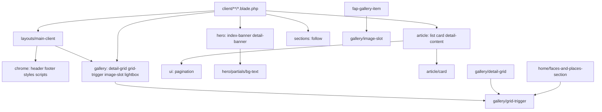

# Phase 1: Research

## Overview

Xác nhận inventory đầy đủ, phụ thuộc giữa component, và danh sách file cần sửa trước khi di chuyển — tránh break runtime hoặc View composer.

## Requirements

- Functional: Liệt kê 100% reference tới `components.clients.*` và `components.layouts.*`
- Non-functional: Migration map phải reversible (git mv), không đổi HTML output

## Architecture

### Component Dependency Graph



### Invocation Audit (hiện tại)

| Pattern | Count | Files |
|---------|-------|-------|
| `<x-clients.hero.*>` | 8 | 4 index + 4 detail pages |
| `<x-clients.gallery.grid-trigger>` | 2 | detail-grid, home FAP section |
| `<x-clients.gallery.fap-gallery-image-slot>` | 9 | fap-gallery-item partial |
| `<x-clients.shared.article-card>` | 1 | article-list (nested) |
| `@include('components.clients.shared.*')` | 6 | article-list, detail-gallery-grid, detail-content-blocks |
| `@include('components.clients.follow-section')` | 9 | hầu hết client pages |
| `@include` chrome in layout | 5 | main-client |
| `->links('components.clients.pagination')` | 1 | article-list |

### PHP Dependencies

```php
// app/Providers/AppServiceProvider.php
View::composer('components.clients.follow-section', ...);
View::composer(['components.clients.footer', ...], ...);
```

## Related Code Files

- Inventory: `resources/views/components/**`
- Call sites: `resources/views/client/**`, `resources/views/components/**`
- Composers: `app/Providers/AppServiceProvider.php` — **3 paths** sau expand (`follow`, `footer`, `contact/main`)
- Page partials: `resources/views/client/**/partials/**` (13 files)
- Tests: `tests/Feature/ClientPageDataBindingTest.php` (render assertions, không reference path trực tiếp)

### Page Partials Inventory (13 files)

| Current path | Target | Tag |
|--------------|--------|-----|
| `client/home/partials/hero-section` | `clients/pages/home/hero` | `<x-clients.pages.home.hero />` |
| `client/home/partials/event-photography-section` | `clients/pages/home/event-photography` | `<x-clients.pages.home.event-photography />` |
| `client/home/partials/photojournalism-section` | `clients/pages/home/photojournalism` | `<x-clients.pages.home.photojournalism />` |
| `client/home/partials/videography-section` | `clients/pages/home/videography` | `<x-clients.pages.home.videography />` |
| `client/home/partials/faces-and-places-section` | `clients/pages/home/faces-and-places` | `<x-clients.pages.home.faces-and-places />` |
| `client/home/partials/partners-section` | `clients/pages/home/partners` | `<x-clients.pages.home.partners />` |
| `client/about/partials/about-section` | `clients/pages/about/main` | `<x-clients.pages.about.main />` |
| `client/contact/partials/contact-main-section` | `clients/pages/contact/main` | `<x-clients.pages.contact.main />` |
| `client/event-photos/partials/gallery-section` | `clients/pages/event-photos/gallery` | `<x-clients.pages.event-photos.gallery />` |
| `client/faces-and-places/partials/fap-gallery-contain-section` | `clients/pages/faces-and-places/gallery-contain` | `<x-clients.pages.faces-and-places.gallery-contain />` |
| `client/faces-and-places/partials/fap-gallery-item` | `clients/pages/faces-and-places/gallery-item` | `<x-clients.pages.faces-and-places.gallery-item />` |
| `client/photojournalism/partials/detail-hero-slider-section` | `clients/pages/photojournalism/detail-hero-slider` | `<x-clients.pages.photojournalism.detail-hero-slider />` |
| `client/videography/partials/detail-hero-slider-section` | `clients/pages/videography/detail-hero-slider` | `<x-clients.pages.videography.detail-hero-slider />` |

<!-- Updated: Validation Session 1 - full partials audit scope -->

## Implementation Steps

1. Chạy inventory:
   ```powershell
   rg "components\.clients|x-clients\." resources/ app/ tests/ --glob "*.{blade.php,php}"
   ```
2. Ghi nhận từng file: domain hiện tại, domain đích, tag mới.
3. Xác nhận `hero/` và `gallery/grid-trigger`, `gallery/lightbox` **không đổi tên** — chỉ di chuyển/xóa `shared/`.
4. Kiểm tra không có `app/View/Components/**` class-based components (confirmed: 0 files).
5. Xác nhận nested include: `fap-gallery-contain-section` → `fap-gallery-item` — chuyển thành `<x-clients.pages.faces-and-places.gallery-item />` trong contain component.
6. Document rollback: `git mv` reverse + restore call sites.

## Success Criteria

- [ ] Bảng migration map đầy đủ 17 component + 13 partial files
- [ ] Danh sách call site cần sửa (grep output)
- [ ] 3 View composer paths được ghi nhận (follow, footer, contact)
- [ ] Không còn reference tới `shared/` hoặc `fap-gallery-image-slot` sau khi implement (baseline grep saved)

## Risk Assessment

- **Missed grep pattern:** Một số file có thể dùng `View::make()` dynamic — grep `clients.` trong toàn `app/`.
- **Mitigation:** Chạy full test suite sau phase 2; manual smoke test layout chrome.
