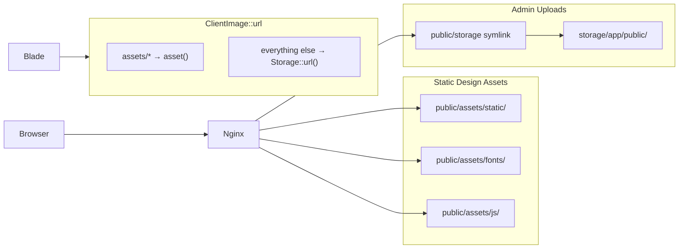

# Static Assets & Performance Optimizations

## Overview

Trang web nhiếp ảnh phụ thuộc nặng vào hình ảnh. Hiện tại codebase đang:

1. **Serve file tĩnh qua PHP** — `routes/web.php` có 2 closure route (`storage/{path}`, `client/assets/{path}`) khởi động full Laravel lifecycle cho mỗi ảnh/font.
2. **ClientImage gọi `file_exists()`** — mỗi ảnh trong gallery loop = 1 disk I/O.
3. **SEO fields có trong DB/Filament nhưng không render** — `main-client.blade.php` chỉ có hard-coded `<title>`.
4. **Pagination view gọi thủ công** — `->links('components.clients.ui.pagination')` thay vì default.
5. **Admin custom routes dùng `auth` middleware** — không khớp `Filament\Http\Middleware\Authenticate`.

**Mục tiêu:** Nginx/`public/` serve static; DB chỉ lưu relative path; URL resolve theo convention (không probe disk); SEO + pagination + admin middleware chuẩn hóa; image optimization là phase tùy chọn.

## Current State

### PHP fallback routes (cần xóa)

```50:72:routes/web.php
// Fallback image routes for local/windows environment
Route::get('storage/{path}', function (string $path) { ... });
Route::get('client/assets/{path}', function (string $path) { ... });
```

Comment ghi rõ đây là workaround Windows — `php artisan serve` và Nginx đều serve trực tiếp từ `public/` mà không cần route.

### Asset layout hiện tại

| Location | Contents |
|----------|----------|
| `public/client/assets/static/` | Design-time static images (PNG, JPG, SVG) |
| `public/client/assets/fonts/` | Be Vietnam, Archivo TTF |
| `public/client/assets/js/` | `gallery-lightbox.js` |
| `storage/app/public/client/assets/static/` | Legacy PNG copies (seed data) |
| `storage/app/public/{articles,partners,...}/` | Admin uploads (Filament FileUpload) |

### ClientImage — disk probe mỗi request

```27:32:app/Support/ClientImage.php
if (Str::startsWith($path, 'client/assets/')) {
    if (Str::endsWith(strtolower($path), '.svg') || file_exists(public_path($path))) {
        return asset($path);
    }
    return Storage::disk('public')->url($path);
}
```

### SEO — data có, view chưa bind

- Models: `Page`, `Article`, `EventAlbum`, `FacesPlacesAlbum` có `seo_title`, `seo_description`, `seo_image`.
- Filament: `SeoTab` đã cấu hình upload disk `public`.
- Layout: `main-client.blade.php` chỉ render `@yield('title')`, không có meta description / OG tags.
- Global default: `SettingSeeder` có `seo_default_image` = `client/assets/static/home/hero-image.png`.

### Pagination

- View: `resources/views/components/clients/ui/pagination.blade.php`
- Gọi thủ công tại `article/list.blade.php`: `$list->links('components.clients.ui.pagination')`

### Admin middleware

```15:18:bootstrap/app.php
Route::middleware(['web', 'auth'])
    ->prefix('admin-custom')
    ->group(base_path('routes/admin.php'));
```

Filament panel dùng `Filament\Http\Middleware\Authenticate` (xem `AdminPanelProvider`).

## Target Architecture



### Path convention (sau migration)

| Path prefix in DB | Resolver | Example URL |
|-------------------|----------|-------------|
| `assets/static/...` | `asset($path)` | `/assets/static/home/hero-image.png` |
| `assets/fonts/...` | `asset($path)` | `/assets/fonts/BeVietnam-Regular.ttf` |
| `articles/covers/...` | `Storage::disk('public')->url($path)` | `/storage/articles/covers/abc.jpg` |
| `partners/...` | `Storage::disk('public')->url($path)` | `/storage/partners/logo.png` |
| Absolute URL / `data:` | passthrough | unchanged |

**Breaking change:** `client/assets/` prefix → `assets/`. Cần migration one-shot cho seeders, factories, tests, và blade hard-codes.

## Phases

| Phase | Name | Effort | Status |
|-------|------|--------|--------|
| 1 | [Research](./phase-01-research.md) | 2h | Pending |
| 2 | [Implement](./phase-02-implement.md) | 1d | Pending |
| 3 | [Test](./phase-03-test.md) | 3h | Pending |

## Implementation Scope (5 workstreams)

### WS-1: Static asset migration + route removal (P1)
- Move `public/client/assets/{static,fonts,js}` → `public/assets/{static,fonts,js}`
- Global replace `client/assets/` → `assets/` in views, seeders, factories, tests
- Migrate `storage/app/public/client/assets/static/` PNGs → either `public/assets/static/` (design assets) or leave as upload paths under new convention
- Delete PHP fallback routes
- Document: `php artisan storage:link` required for dev/prod uploads

### WS-2: ClientImage simplification (P1)
- Remove `file_exists()` branch
- Convention-based: `assets/` → `asset()`, else → `Storage::url()`
- Keep absolute URL / `data:` passthrough
- Update `GalleryImage` callers — no API change needed

### WS-3: SEO meta rendering (P1)
- Create `<x-clients.chrome.seo-meta>` component
- Accept `?Seoable $model` + global defaults from `Setting`
- Wire into `main-client.blade.php` `<head>`
- Controllers/detail views pass SEO model via `@section` or shared variable

### WS-4: Pagination default (P2)
- `Paginator::defaultView('components.clients.ui.pagination')` in `AppServiceProvider`
- Remove explicit `->links(...)` calls

### WS-5: Admin auth middleware (P2)
- Replace `'auth'` with `Authenticate::class` in `bootstrap/app.php`

### WS-6: Image optimization (P1 — confirmed in validation)
- Install `spatie/laravel-image-optimizer` (or GD/Imagick fallback)
- Optimize on Filament admin upload (Observer or `afterStateUpdated` hook)
- Generate WebP variants + thumbnails on upload
- Artisan command `images:optimize-existing` to backfill existing uploads in `storage/app/public/`

## Cross-Plan Dependencies

| Plan | Relationship | Notes |
|------|--------------|-------|
| `260619-restructure-components` (pending) | **Run after this plan** | Validation confirmed: static-assets-performance first, then restructure-components. |
| `260617-grid-gallery-lightbox` (completed) | **Aware** | `gallery-lightbox.js` path đổi → cập nhật `lightbox.blade.php` |
| `260619-standardize-hero-banner` (completed) | None | Không conflict |

## Risk Assessment

| Risk | Impact | Mitigation |
|------|--------|------------|
| Broken images sau path migration | High | Automated test suite + visual smoke on all pages |
| Windows dev without `storage:link` | Medium | README/deploy docs; `storage:link` in setup script |
| SEO regression (missing OG on detail pages) | Medium | Feature test asserts meta tags per page type |
| Filament upload paths unchanged | Low | Uploads already use `articles/...` paths — không cần đổi |

## Success Criteria (plan-level)

- [ ] Zero PHP routes serving static files
- [ ] All static assets under `public/assets/`
- [ ] `ClientImage::url()` has zero filesystem calls
- [ ] `<meta name="description">` and `og:*` tags render on index + detail pages
- [ ] Pagination works without explicit `->links()` call
- [ ] `admin-custom` routes use Filament `Authenticate` middleware
- [ ] Image optimization on upload + `images:optimize-existing` backfill command
- [ ] All existing Pest tests pass (updated assertions)

## Recommended Cook Order

```
/ck:cook c:\Users\minhlong\Desktop\projects\la-hieu-fullstack\plans\260619-static-assets-performance\plan.md
```

Implement theo thứ tự trong phase-02: WS-1 → WS-2 → WS-3 → WS-4 → WS-5 → WS-6.

## Validation Log

### Session 1 — 2026-06-19
**Trigger:** `/ck:plan validate` after plan creation
**Questions asked:** 4

#### Verification Results
- Claims checked: 12
- Verified: 12 | Failed: 0 | Unverified: 0
- Tier: Standard (Fact Checker + Contract Verifier)
- Evidence: `routes/web.php:50-72` (PHP fallback routes), `ClientImage.php:28` (`file_exists`), `main-client.blade.php` (no SEO meta), `article/list.blade.php:46` (manual pagination), `bootstrap/app.php:15` (`auth` middleware), `public/storage` symlink exists

#### Questions & Answers

1. **[Architecture]** Đổi prefix đường dẫn `client/assets/` → `assets/`?
   - Options: full_rename | keep_prefix | alias_both
   - **Answer:** full_rename
   - **Rationale:** Clean URLs `/assets/static/...`; single convention in DB

2. **[Scope]** WS-6 Image Optimization scope?
   - Options: defer | include_basic | include_full
   - **Answer:** include_full
   - **Rationale:** Upload optimization + `images:optimize-existing` backfill command

3. **[Architecture]** Cách truyền SEO data vào layout?
   - Options: inline_php | view_composer | controller
   - **Answer:** view_composer
   - **Rationale:** DRY — composer detects `$page`, `$article`, `$album` from view data

4. **[Scope]** Thứ tự vs `260619-restructure-components`?
   - Options: static_first | restructure_first | merge
   - **Answer:** static_first
   - **Rationale:** Path migration + performance fixes ship first; restructure runs after

#### Confirmed Decisions
- Path prefix: `assets/` (breaking change, global replace)
- Image optimization: full scope (upload hook + backfill command)
- SEO wiring: View Composer on `main-client` layout
- Plan order: static-assets → restructure-components

#### Action Items
- [ ] Add WS-6 implementation steps to phase-02
- [ ] Replace inline SEO `@php` approach with View Composer design in phase-02
- [ ] Add `images:optimize-existing` command to phase-03 test plan

#### Impact on Phases
- Phase 2: WS-6 promoted from optional to required; SEO via View Composer
- Phase 3: Add image optimization + backfill command tests

### Whole-Plan Consistency Sweep
- Scanned: `plan.md`, `phase-01-research.md`, `phase-02-implement.md`, `phase-03-test.md`
- Stale terms resolved: WS-6 "optional/P3" → P1 required; SEO "inline @php" → View Composer
- Unresolved contradictions: **0**
